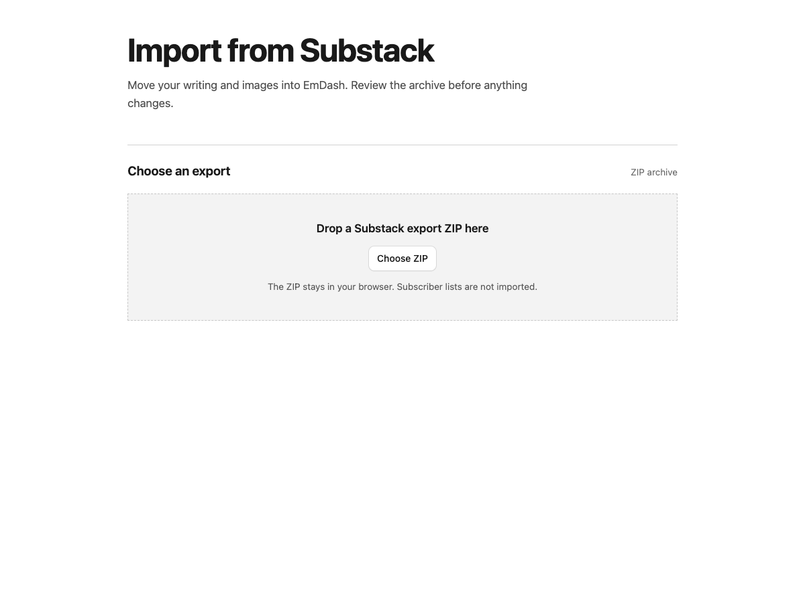
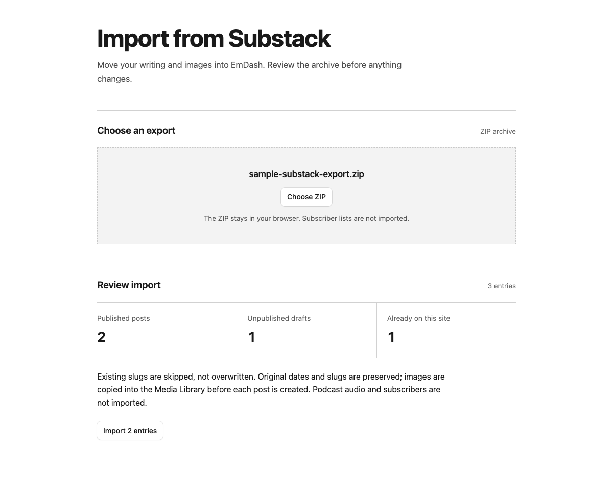
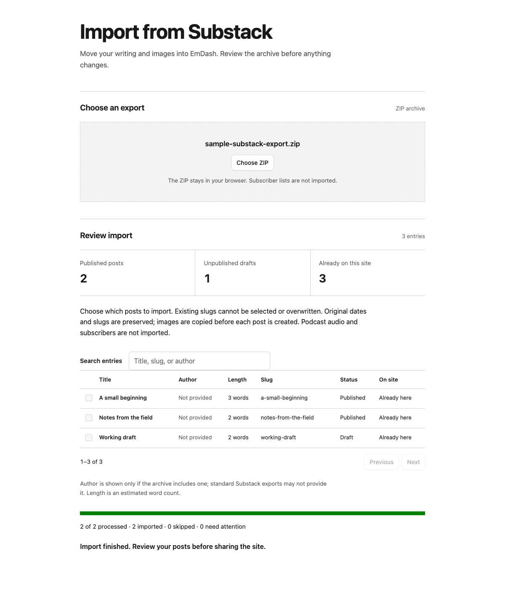

# EmDash Substack Importer

A native EmDash plugin that imports a Substack export ZIP through an admin page, plus a migration CLI for larger or more complex exports.

## How the admin import works

Screenshots of the plugin UI using a sample three-post ZIP and simulated API responses:

1. Download your Substack export ZIP, open the importer in EmDash, and choose or drop the ZIP. The archive stays in your browser; subscriber files are ignored.

   

2. Review the published and draft counts, then choose posts in the table. Search by title, slug, or author; use **Select all** or **Clear selection** for the entire archive, even when searching or viewing another page. The table shows estimated word count, status, and whether a slug is already on the site. Existing posts are visible but cannot be selected or overwritten. Standard Substack exports do **not** provide author metadata, so the author column says “Not provided” unless the archive contains one. In this sample, two of three entries are available and selected.

   

3. Import only the selected posts. See processed, imported, skipped, and failed counts. Images are copied before their posts are created. Pause stops after the current post. When finished, review the imported posts and any entries needing attention in EmDash.

   

## Install the admin UI

Clone the repository, build the plugin, and add it to your EmDash site:

```bash
git clone https://github.com/leostera/emdash-plugins.git
cd emdash-plugins
bun install
bun run build
cd ../your-emdash-site
bun add ../emdash-plugins/packages/emdash-substack-importer
```

Register the native descriptor in the site's `astro.config.mjs`:

```js
import { substackImporter } from "@leostera/emdash-substack-importer";

// In the emdash() integration options:
plugins: [substackImporter()],
```

Build and deploy the site, then open `/_emdash/admin/plugins/emdash-substack-importer/import`. Only administrators with `plugins:manage` can use the import screen. Choose the Substack ZIP; the browser reads only `posts.csv` and matching post HTML. The screen checks the schema and existing slugs, shows a searchable, paginated selection table, and waits for explicit confirmation. It imports only selected posts, one at a time, copies their images to EmDash media, and shows progress and failures. Pausing finishes the current post first. On retry, existing slugs are skipped rather than overwritten.

**Limits:** ZIP ≤32 MB compressed, ≤96 MB unpacked post files, ≤2,000 posts; remote image responses are bounded by the EmDash plugin HTTP bridge (8 MiB). Larger exports should use the CLI. Only supported JPEG, PNG, GIF, WebP, and AVIF images are copied. Newsletter subscriber CSVs are never unpacked, stored, or imported; podcast audio, comments, and complex HTML embeds are not migrated. The site must already render the chosen slug URL pattern. Review posts in the admin before announcing the migration. Failed publish calls can leave a draft that needs review before retrying.

The browser keeps the ZIP locally; it sends parsed post content to the authenticated EmDash content API and only individual Substack image URLs to a private admin-only plugin route. This **native** plugin runs with the site's authority. Audit and trust the package before installing it.

## Run the existing migration CLI

Unzip your Substack export to a directory containing `posts.csv` and `posts/*.html`. It may also contain `email_list.*.csv`, which the CLI **never reads**. Keep it outside Git. The site must already have a `posts` collection, a `content` Portable Text field, an `excerpt` field, and routes for its chosen URL pattern.

```bash
bun install
bunx emdash login --url https://example.com
bun --filter @leostera/emdash-substack-importer import:substack --url=https://example.com --archive=/private/path/to/export
# After reviewing the dry run:
bun --filter @leostera/emdash-substack-importer import:substack --url=https://example.com --archive=/private/path/to/export --apply
bun --filter @leostera/emdash-substack-importer migrate:images --url=https://example.com --archive=/private/path/to/export --apply
bun --filter @leostera/emdash-substack-importer cleanup:images --url=https://example.com --archive=/private/path/to/export --apply
```

`--url-pattern=/{slug}` on the import command is optional; use it only if your actual Astro pages serve posts at the root. Commands are dry-run by default. Re-running skips existing slugs and already-migrated image blocks. Unpublished posts remain drafts. The importer preserves exported publish timestamps and imports image references through EmDash media storage. The cleanup removes paragraphs produced by Substack's linked-image HTML when converting to Portable Text.
